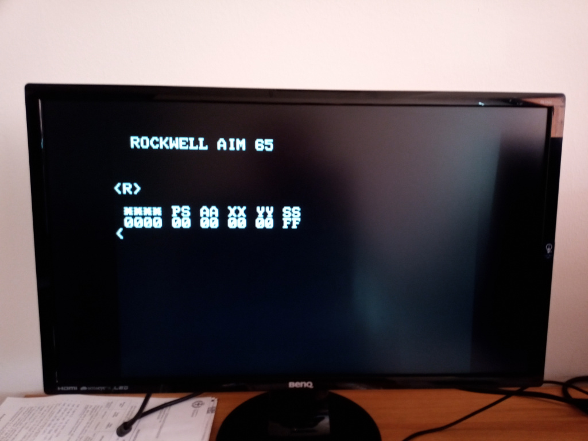

# aim65_quartus
This is an alpha release of the AIM65 in an Intel FPGA using the Arrow SocKIT board. 
The Arrow SocKIT board is a nearly compatible TerASIC DE10 board where MiSTer runs. 
There is a MiSTer port on the Arrow SocKIT here, and as I have a SocKIT board I used their templates.  
Behind the templates, the structures seem to me very similar, so probably a port on the MiSTer board should be relatively easy, but I don't have such board. 
 
Basically the aim65_quartus runs like an AIM65 at 1 MHz, has 32KBytes (!) of ram and excluding printer and tape all the peripherals are in place and runs. 
The 6502 core is the Arlet one, or the 65C02 version based on the Arlet core. 
The AIM65 displays are routed to a simple video output, some pictures below. 
The MiSTer menu can be used to have the expansion rom with basic, forth and pl/65, again some pictures below 
 
<h3>Still to do:</h3>
<li>find a way to load and store programs, i'm still studying the MiSTer framework</li>
<li>fix an annoying behaviour on the serial port</li>
<li>find why sometimes the screen jumps</li>
<li>fix the keyboard as for now works only with US keyboard</li>
<li>a lot of more I have not yet found ...</li>
 
As an additional, and in my opinion useful, add on I have implemented a clear screen pressing F4, currently not used on real AIM65. 
This too needs a bit of fixing here and there, but when time will leave me to work on it again I will try to fix it 
 

 Just booted, R command in action ... 

