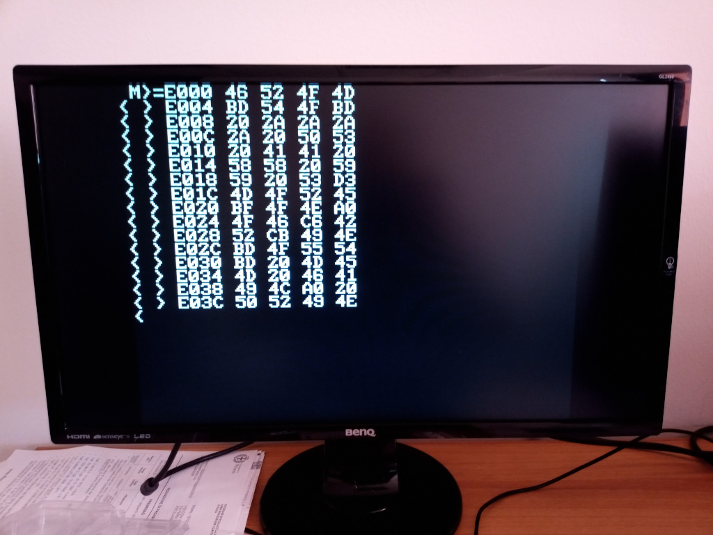
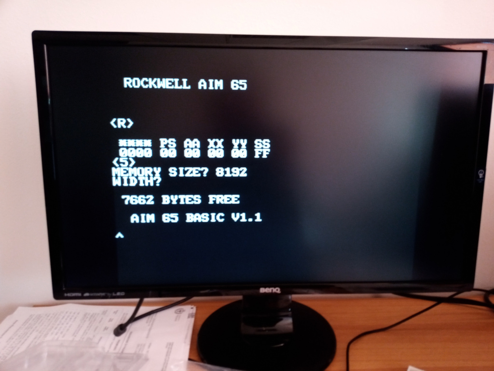
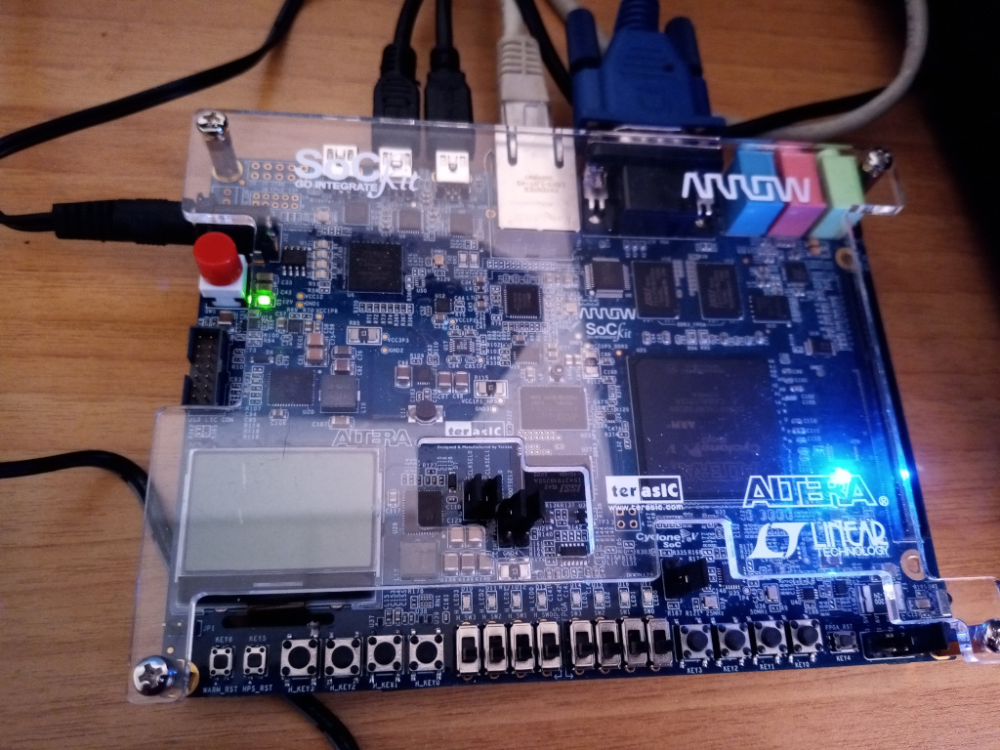

# aim65_quartus
This is an alpha release of a verilog <a href="https://en.wikipedia.org/wiki/AIM-65">Rockwell AIM65</a> in an Intel FPGA using the <a href="https://www.arrow.com/en/products/sockit/arrow-development-toolsArrow">SocKIT</a> board. 
The Arrow SocKIT board is a nearly compatible <a href="http://www.terasic.com.tw/cgi-bin/page/archive.pl?Language=English&No=364">TerASIC DE0</a> board where <a href="https://github.com/MiSTer-devel">MiSTer</a> runs. 
This is a MiSTer port on the Arrow SocKIT, and as I have a SocKIT board I used their templates from <a href="https://github.com/sockitfpga">MiSTer SocKIT FPGA</a> page.  
Behind the templates, the structures seem to me very similar, so probably a port on the MiSTer board should be relatively easy, but I don't have such board. 
 
Basically the aim65_quartus runs like an AIM65 at 1 MHz, has 32KBytes of ram ( who had so much ram ? not me for sure ! ) and excluding printer and tape all the peripherals are in place and runs. 
 The ROMs come from <a href="http://retro.hansotten.nl/6502-sbc/aim-65/">Hans Hotten</a> funtastic pages, like all the other information I found there.
The 6502 core is the <a href="http://https://github.com/Arlet/verilog-6502">Arlet</a> one, or the <a href="https://github.com/hoglet67/CoPro6502/tree/master/src/Arlet">Hoglet67 65C02</a> version based on the Arlet core. 
The 20 AIM65 alphanumeric displays are routed to a simple video output, some ( quite bad I know ) pictures below. 
The MiSTer menu can be used to have the expansion rom with basic, forth and pl/65, again some pictures below 
Still with the MiSTer menu the serial port can be enabled, the characters color can be changed and the video can run at full screen 
 
<h3>Still to do:</h3>
<li>find a way to load and store programs, i'm still studying the MiSTer framework</li>
<li>fix an annoying behaviour on the serial port, tricky enough</li>
<li>find why sometimes the screen jumps</li>
<li>fix the keyboard as for now works only with US keyboard</li>
<li>a lot of more bugs I have not yet found ...</li>
 
As an additional and in my opinion useful add on, I have implemented a clear screen pressing F4, currently not used on real AIM65. 
This too needs a bit of fixing here and there, but when time will leave me to work on it again I will try to fix it 
 

Just booted, R command in action
   

Some memory dump
    

Basic started
    

The board where AIM65 runs ...
     

Many thanks to <a href="http://retro.hansotten.nl/6502-sbc/aim-65/">Hans Hotten</a> for the funtastic work 
 And comments are welcome

